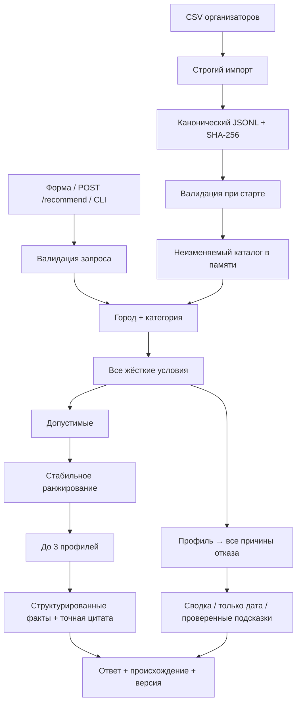

# Архитектура и алгоритм

## 1. Статус компонентов

| Компонент | Статус в этом репозитории |
|---|---|
| Импорт, валидация, аудит | Реализован |
| Фильтрация и диагностика | Реализован |
| Детерминированный лексический ranker | Реализован |
| Извлечение точной цитаты | Реализован |
| Локальный API / HTML / CLI | Реализован |
| Проверенные изменения даты/бюджета | Реализован |
| LLM-извлечение и multilingual embeddings | Спроектированы, не реализованы |
| Краткие контрастные объяснения на структурированных признаках | Следующая итерация |
| FastAPI / публичный deployment | План пилота |

## 2. Границы и поток данных



Доменный код не зависит от HTTP и браузера. В стандартном запуске нет сетевого доступа, базы данных, изменяемых сессий или случайного выбора. Локальный HTTP-адаптер можно заменить на FastAPI, сохранив `recommend(catalog, request)` и тесты.

## 3. Допуск кандидатов

Обозначения: запрос `q`, профиль `p`, исходный каталог `D`.

```text
C = {p ∈ D : p.city = q.city ∧ q.category ∈ p.categories}

eligible(p,q) =
    q.date ∉ p.busy_dates
  ∧ p.price_from_kzt ≤ q.budget_kzt
  ∧ q.event_format ∈ p.event_formats
  ∧ (q.language отсутствует ∨ q.language ∈ p.languages)
  ∧ (q.duration отсутствует ∨ p.max_hours = null ∨ q.duration ≤ p.max_hours)
```

Регистр и внешние пробелы ввода нормализуются; `ё`/`е` учитываются для города и категории. Категории сопоставляются целиком: `Ведущий` не совпадает с `Ведущий церемонии`. Широкие синонимы, поездки в другой город и расширение форматов из описания не применяются.

**Порядок определения исхода:**

1. Если `C` пусто → `no_category_in_city`.
2. Иначе применить все условия, получить `E`.
3. Если `E` пусто → `no_match`.
4. Иначе → `matched`, вернуть `min(3, |E|)` карточек.

Так отсутствие формата не маскируется под отсутствие категории. В интеграции с агрегатором `D` должен ограничиваться уже разрешённым пользователю каталогом; внешний поиск профилей не нужен.

## 4. Диагностика без двойного счёта

Для каждого `p ∈ C` вычисляется **всё** множество нарушений, а не только первое. Оно сохраняется в `diagnostics.rejected`.

В ответе два разных представления:

- `primary_exclusions`: первая причина в фиксированном порядке `busy → budget → format → language → duration`. Каждый исключённый профиль учитывается ровно один раз, удобно для понятной сводки.
- `all_exclusions`: все причины. Один профиль может попасть в несколько счётчиков; их сумма может быть больше числа исключённых.

Инвариант:

```text
cohort_count = eligible_count + sum(primary_exclusions.values())
```

Первая причина — способ бухгалтерского учёта, **не утверждение о единственной причине**. Поэтому сводка подписана «каждый профиль учтён один раз», а причинная диагностика считается отдельно:

```text
blocked_only_by_date = count(failures(p,q) == {busy})
eligible_ignoring_date = eligible_count + blocked_only_by_date
```

Например, занятые Эмилия и Софи могут ещё не подходить по формату или бюджету. Неверно утверждать, что перенос даты автоматически сделает их допустимыми.

### Проверенные подсказки для `no_match`

- **Бюджет:** берём профили, у которых единственное нарушение — бюджет; минимальная их стартовая цена есть минимальный бюджет, при котором хотя бы один пройдёт все остальные условия.
- **Дата:** перебираем дни на расстоянии не более 7 дней в обе стороны, внутри известного окна; порядок — расстояние, затем дата по возрастанию. На каждой дате пересчитываем все ограничения. Возвращаем первую, на которой есть хотя бы один вариант.
- Если одиночное изменение не помогает, соответствующей подсказки нет.

Подсказка содержит только новое значение, число допустимых и пояснение. Исходный запрос и карточки не изменяются.

## 5. Ранжирование reference MVP

### Точный текущий ключ

```python
key = (-lexical_hits_count, price_from_kzt, id)
```

`lexical_hits_count` — число различных корней из открытого словаря формата, найденных в начале слов описания. Пример для корпоратива: `корпоратив`, `бизнес`, `делов`, `бренд`. Повторы одного корня не добавляют баллы. Полный словарь — `eventmatch/engine.py`, версия `rules-lexical-v1`.

Если число совпадений одинаково, выбирается меньшая стартовая цена; при точном равенстве — лексикографический `id`. Это продуктовая политика разрешения равенства, а не предсказание качества.

**Почему этот baseline достаточен как проверочная основа:**

- использует описание, а не только сортировку по цене;
- прост для объяснения жюри и воспроизведения;
- не добавляет баллы за совпадения, одинаковые у всех после фильтрации;
- не имеет внешних отказов и необоснованных вероятностей.

**Его предел:** корни не понимают отрицания, синонимы, рекламный контекст и истинную специализацию. Для юбилея и дня рождения словарь особенно узок. Более длинные описания могут содержать больше разных релевантных корней; отсутствие бонуса за повторы не устраняет этот косвенный эффект. Поэтому baseline — контрольная линия для оценки AI, а не объявленный «идеальный ranker».

### Почему сейчас нет искусственной diversity-перестановки

Разнообразие карточек достигается выбором разных оснований. Перестановка ради «одного дешёвого, одного премиального» может подменить запрос клиента. Если позднее вводить MMR/diversity, ограничить её кандидатами близкой релевантности, сделать формулу явной и проверить улучшение на пользовательской оценке.

## 6. Объяснения и источники

### Реализованный контракт

1. Первое предложение: дата, формат, конкретная цена и бюджет; при наличии — язык и часы.
2. Второе: точный фрагмент `description`, атрибутированный профилю.

Каждая карточка содержит `evidence`: ссылки на структурированные поля и цитату:

```json
{
  "field": "description",
  "start": 0,
  "end": 42,
  "quote": "точный фрагмент текста соответствующей длины"
}
```

Этот блок иллюстрирует форму; реальные координаты и цитаты берутся из `examples/responses/`. Координаты — индексы символов Python, полуинтервал `[start, end)`, не смещения байт UTF-8 и не индексы UTF-16 JavaScript.

Инвариант: `description[start:end] == quote`.

### Выбор цитаты в baseline

Из описания выделяются фрагменты по границам `. ! ?` и переводам строк. Фрагменты короче 20 символов пропускаются, длинные ограничиваются 220 символами по границе слова. При отсутствии подходящего фрагмента используется начало описания.

Ключ выбора:

1. Больше лексических совпадений с форматом.
2. Выше доля слов, встречающихся только у этого профиля среди исходной группы город/категория.
3. Раньше позиция в описании.

Редкость считается относительно всей исходной группы, не только свободных сегодня. Это не позволяет объяснениям случайно меняться вслед за календарём других профилей. Редкие слова — эвристика различимости, не показатель качества и не фактор ранга подрядчика.

### Целевое контрастное объяснение

Для каждого выбранного профиля строить несколько допустимых оснований и выбирать то, которое одновременно:

- связано с запросом;
- подтверждено источником;
- содержательно отличается от оснований остальных карточек;
- не повторяет лишь имя или ID.

Если двое предлагают одинаковую услугу, честно различать их ценой, часами или конкретным составом. Если различий в данных нет вообще, нельзя их выдумывать: показать факт равенства и признать ограничение данных. Уникальность строк не доказывает полезную различимость; это проверяется отдельно людьми.

## 7. Целевой AI-слой (план)

### 7.1 Задача AI

Выделить и связать с запросом **наблюдаемые особенности**: стиль ведения, жанр съёмки, инструменты, состав группы, вид оформления, особенности площадки. AI не решает занятость, город, цену, язык и максимум часов.

### 7.2 Офлайн извлечение признаков

Плановый артефакт: `data/derived/profile_features.jsonl`.

```text
profile_id
description_sha256
extractor_model + extractor_revision + prompt_version
features[]:
  feature_id
  kind: style | service | experience_claim | venue_attribute
  evidence_span_id
  quote + start + end
  applicable_formats[]
  claim_type: profile_claim
```

**Рекомендуемая процедура:**

1. Детерминированно разбить текст на именованные фрагменты.
2. Передать модели профиль и список `span_id → text` как данные.
3. Попросить выбрать только существующие `span_id`, назначить тип признака и связанный формат; разрешить пустой список.
4. Самим восстановить текст и координаты из выбранных IDs.
5. Проверить схему, существование ID, hash описания, допустимые типы, отсутствие дублирования.
6. Сохранять неподтверждённые или конфликтующие признаки как непригодные для генерации.

Модель не должна создавать числовые факты, расширять структурированные поля или выполнять инструкции из описания профиля. Возвращение идентификаторов фрагментов надёжнее просьбы «напиши красивый абзац и не галлюцинируй».

### 7.3 Готовые эмбеддинги

Возможный локальный вариант — multilingual-e5-small после проверки качества русского на конкретных текстах; альтернативный поставщик API допустим, если доступны ключи. Выбор конкретной модели и revision фиксируется в артефакте до сравнения, а не подменяется во время демонстрации.

Поскольку обязательный запрос имеет только тип и категорию, число смысловых намерений ограничено: максимум **6 × 17 = 102** комбинации. Для них можно заранее посчитать векторы и целочисленные оценки релевантности каждому профилю/фрагменту. Изменение даты, бюджета, языка и часов влияет на допуск, а не требует нового вызова модели.

```text
intent = canonical(category, event_format)
semantic_int = round(1_000_000 × cosine(intent_embedding, evidence_embedding))
```

Дообучения на 66 профилях нет. Для E5 обязательно применять ожидаемые моделью префиксы `query:` / `passage:` и нормализацию векторов; параметры сохраняются вместе с версией.

### 7.4 Два этапа подключения

**Первый:** использовать семантику только для выбора лучшего подтверждённого основания, сохраняя текущий порядок. Так можно отдельно измерить улучшение объяснений.

**Второй:** включить семантическое ранжирование после разметки и сравнения. Начальный прозрачный ключ:

```text
(-semantic_relevance_int, price_from_kzt, id)
```

Нельзя интерпретировать cosine как «98% подходит». Порог семантики не должен удалять кандидата, проходящего обязательные условия: это мягкий сигнал, особенно в редких категориях.

### 7.5 Детерминизм AI

`temperature=0` не является достаточной гарантией. Нужны:

- замороженные признаки/оценки;
- SHA-256 исходных данных и артефактов;
- `model`, `revision`, `prompt_version`, `policy_version`;
- сохранённые целочисленные оценки вместо пересчёта float на каждой машине;
- фиксированный tie-break по цене и `id`;
- отсутствие зависимости от истории чата, системного времени и случайного seed.

На старте выбирается **один фиксированный режим**: полный совместимый AI-артефакт либо baseline. Нельзя незаметно смешивать разные версии или менять ranker на каждом запросе в зависимости от таймаута сети. Режим отражается в `meta`.

### 7.6 Если нужен LLM для формулировки

Только после выбора карточек и подготовки evidence. Он получает разрешённые факты трёх профилей, не весь каталог; возвращает по 1–2 предложения с `evidence_id` на каждое утверждение. Факты о цене, дате и часах лучше рендерить кодом. Неподтверждённый ответ заменяется extractive-шаблоном.

На однодневном хакатоне онлайн-перефразирование имеет меньший приоритет, чем офлайн-извлечение. Если всё же включать: общий бюджет времени не более 3–4 секунд на весь текст, один пакетный вызов, кэш по fingerprint, без бесконечных retries. Стабильность выбора обеспечивается независимо от текста.

## 8. Версионирование

В реализованном ответе:

```text
dataset_sha256
policy_version = rules-lexical-v1
request_fingerprint = SHA256(canonical_request + dataset_sha256 + policy_version)
explanation_mode = extractive-lexical
```

Hash зависит от канонического запроса. При одинаковом содержимом каталога, политике и запросе ответ воспроизводится полностью. Изменение данных или политики является новой версией решения, даже если параметры пользователя те же.

AI-версия должна дополнить ключ hash признаков/эмбеддингов, чтобы кэш не сохранял объяснения от старого описания.

## 9. Сложность и стек

Загрузка — один раз при старте. Проверка условий — `O(N)`, `N=66`; сортировка — `O(K log K)` по допустимым. Календари — множества ISO-дат с проверкой в среднем `O(1)`. Для трёх карточек текущая цитатная эвристика повторно считает частоты слов внутри небольшой группы; в пилоте их можно подготовить заранее.

Текущий стек: Python, dataclasses, стандартный JSON/HTTP, unittest, HTML/JS. Для пилота: FastAPI/Pydantic, те же чистые доменные функции, версионированные артефакты, метрики. Векторная база для 66 векторов не требуется; простой массив достаточен даже после подключения эмбеддингов.
